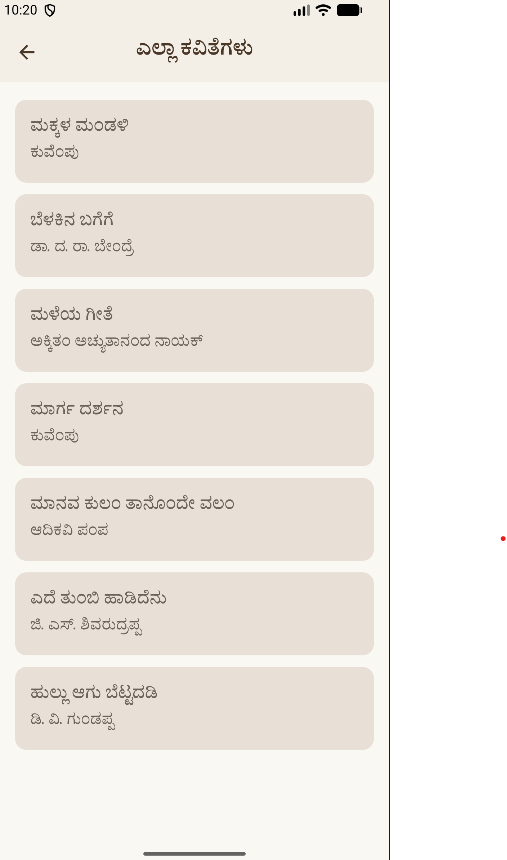
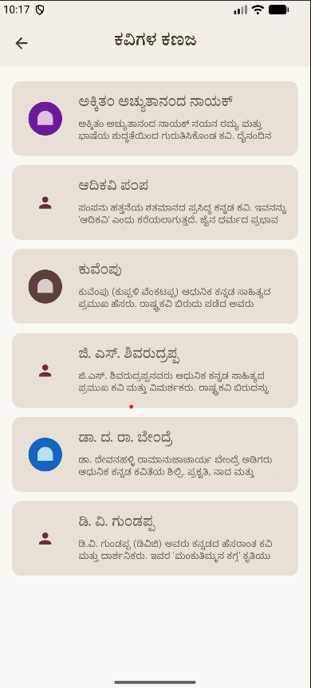
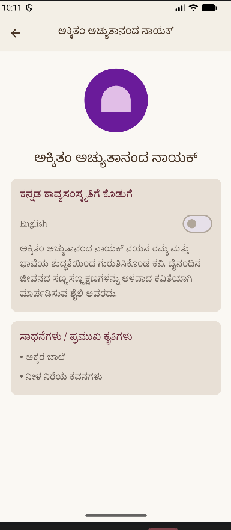
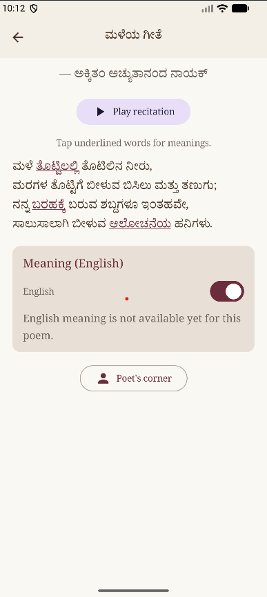
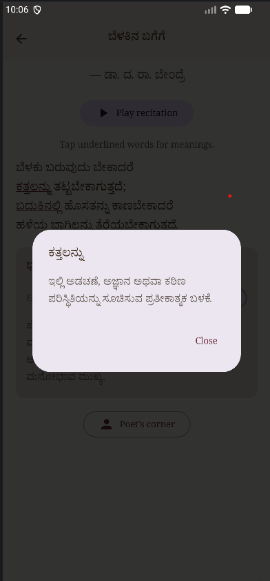
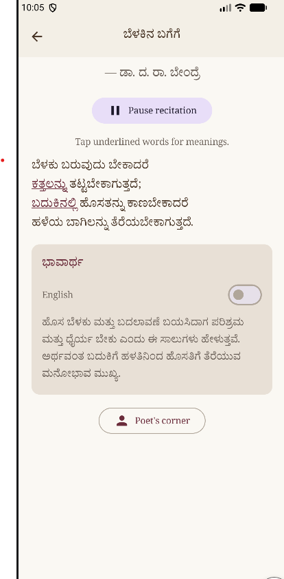

## 📱 Screenshots

<!-- **Home Screen**
 -->

**Poem List**


**Poets Corner List**


**Poets Corner**


**English Translation**


**Word Popup**


**Audio Recitation**


A modern Kannada poetry app built with Jetpack Compose, designed to celebrate poems and poets with a clean, expressive UI.

## ✨ What makes this project special

- **Beautiful Jetpack Compose interface** with Material 3 styling
- **Daily featured poem** on the home screen
- **Browse complete poem collection** with rich detail screens
- **Explore poets** and learn more about their work
- **Clean architecture** using repository and view model patterns
- **Offline-ready Android app** with local data handling

## 🚀 Screens included

- **Home**: poem of the day, quick access to poems and poets
- **Poem List**: browse all poems in a single flow
- **Poem Detail**: read poem text with intuitive navigation
- **Poet List**: discover poets and their works
- **Poet Detail**: learn about each poet and open related poems

## 🧩 Tech stack

- Kotlin
- Android Jetpack Compose
- Material 3
- Navigation Compose
- ViewModel + state handling
- Kotlin Serialization

## 💡 Why use this repo

`KavyaKanaja` is ideal if you want a polished Android poetry app with:
- expressive typography
- clean navigation
- modern Compose architecture
- a bilingual Kannada / English experience

## 🛠️ Setup

```bash
cd C:\Users\spoor\Downloads\KavyaKanaja
```

Open the project in Android Studio and sync Gradle.

Then build and run on an emulator or device with Android API 26+

## 📦 Build

- `./gradlew clean assembleDebug`
- `./gradlew assembleRelease`

## 🤝 Want to contribute?

1. Fork the repo
2. Create a feature branch
3. Add new poems, themes, or audio playback
4. Submit a pull request

---

**KavyaKanaja** brings Kannada poetry into a sleek Android experience. Perfect for expanding into a full poetry library, audio narration, or learning app.
